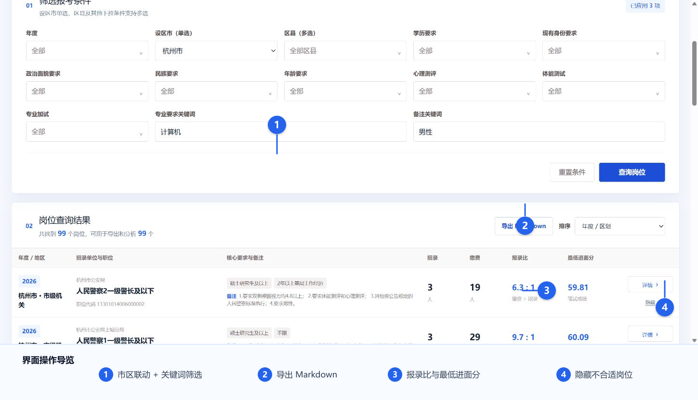
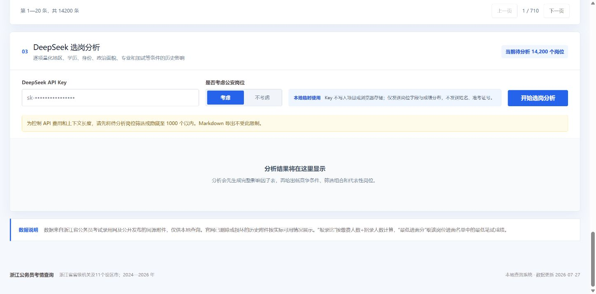

# 浙江公务员考情查询系统

<p align="center">
  
  
  = 22.13">
  
  
</p>

一个面向浙江省公务员岗位的本地考情查询工具。它将招考条件、缴费人数、报录比、最低进面分、面试成绩和录用结果关联到同一岗位，并支持把筛选结果导出为 Markdown，或交给 DeepSeek 生成结构化选岗分析。

> [!IMPORTANT]
> 本项目不是浙江省公务员主管部门或浙江省公务员考试录用网的官方产品，仅用于整理和查询历史公开信息。报考资格、招录政策和最终名单请以当年官方公告为准。


## 功能亮点

- 覆盖浙江省级机关和 11 个设区市，时间范围为 2024—2026 年。
- 设区市单选、区县联动多选，并支持学历、身份、政治面貌、民族、年龄、心理测评、体能测试和专业加试等多条件组合。
- 专业要求和备注支持关键词查询，例如“计算机”“男性”。
- 结果同时展示招录人数、缴费人数、报录比、最低进面分和岗位备注。
- 岗位详情可查看完整岗位要求、进面人员笔试/面试成绩和最终录用结果。
- 单个岗位可以隐藏；隐藏后变灰，但仍可恢复，且不参与后续导出和 AI 分析。
- 可导出适合交给大模型继续分析的 Markdown 文件。
- 可选是否考虑公安岗位，并调用 DeepSeek 生成筛选条件影响因子表和选岗建议。
- DeepSeek 返回结果通过 GFM Markdown 渲染，支持表格、标题、列表和引用。

## 界面与使用流程



1. 选择设区市，再多选对应区县；继续设置资格条件或输入专业、备注关键词。
2. 点击“查询岗位”，根据报录比、最低进面分或招录人数排序。
3. 对明显不适合的岗位点击“隐藏”，缩小后续导出和分析范围。
4. 点击“导出 Markdown”，得到完整岗位考情文本。
5. 如需 AI 分析，将待分析岗位控制在 1,000 个以内，输入自己的 DeepSeek API Key 后发起分析。



## 数据范围

| 项目 | 数量 |
| --- | ---: |
| 招录岗位 | 14,200 |
| 2024 年岗位 | 5,022 |
| 2025 年岗位 | 5,174 |
| 2026 年岗位 | 4,004 |
| 已关联缴费人数岗位 | 14,106 |
| 进面/总成绩人员记录 | 43,276 |
| 最终录用人员记录 | 16,342 |
| 数据构建读取的原始文件 | 2,469 |

区域包括浙江省级机关，以及杭州、宁波、温州、嘉兴、湖州、绍兴、金华、衢州、舟山、台州、丽水 11 个设区市及其下属区、县和县级市。

报录比按“缴费人数 ÷ 招录人数”计算；最低进面分取该岗位已关联进面人员中的最低笔试成绩。

## 快速开始

### Windows 一键启动

先安装 [Node.js](https://nodejs.org/) 22.13 或更高版本，并在项目目录安装依赖：

```powershell
npm install
```

随后双击项目根目录的 `启动系统.cmd`。看到终端显示本地地址后，在浏览器打开：

<http://localhost:3000/>

停止系统时，在运行窗口按 `Ctrl+C`。

### 命令行启动

```powershell
git clone https://github.com/Matt-Ma-C/ZJgkcx.git
cd ZJgkcx
npm install
npm run dev
```

开发服务器通常运行在 <http://localhost:3000/>；如果端口已被占用，请以终端实际显示的地址为准。

## 如何查询岗位

### 1. 设置筛选条件

- 年度、区县以及大多数报考条件可以多选。
- 设区市只能单选；选择设区市后，区县选项会自动切换到该市下属区县。
- 点击选择框以外的区域，已打开的多选框会自动关闭。
- 专业要求和备注采用关键词包含匹配，可以只输入关键字而非完整句子。

### 2. 阅读查询结果

岗位列表展示以下核心指标：

- 招录单位、职位名称和职位代码；
- 学历、现有身份等核心要求以及完整备注；
- 招录人数、缴费人数和报录比；
- 最低进面笔试成绩；
- 岗位详情、隐藏与取消隐藏操作。

点击职位名称或“详情”可查看岗位表全部字段，以及已关联人员的笔试成绩、面试成绩、总成绩、排名和录用结果。

### 3. 导出 Markdown

“导出 Markdown”会导出所有未隐藏岗位，不受 DeepSeek 的 1,000 个岗位上限约束。主要字段包括：

- 年度和地区；
- 招录单位与职位；
- 核心要求与备注；
- 招录人数、缴费人数、报录比；
- 最低进面分；
- 参加面试人员笔试和面试成绩的最小值、P25、中位数、P75 和最大值。

导出的文件可直接提交给其他大模型，继续做跨岗位比较或制定筛选策略。

### 4. 使用 DeepSeek 分析

1. 将查询结果筛选或隐藏到 1,000 个岗位以内。
2. 输入自己的 DeepSeek API Key。
3. 选择“考虑”或“不考虑”公安岗位。
4. 点击“开始选岗分析”。

分析提示词会逐项比较年度、地区、学历/学位、现有身份、政治面貌、民族、年龄、专业、心理测评、体能测试、专业加试、备注限制和职位特征，并同时参考报录比与最低进面分。

系统要求模型报告样本量和可信度，区分历史相关与因果关系，并在数据不足时明确写出“当前样本无法比较”。公安岗位只有在用户选择考虑时才会进入分析。

> [!NOTE]
> API Key 仅保存在当前页面内存中，不写入项目文件或浏览器存储。在线分析只提交岗位字段和成绩分布，不提交姓名、准考证号等人员信息。DeepSeek API 可能产生费用，调用前请确认账户余额和模型可用性。

## 数据来源与已知限制

- 数据来自[浙江省公务员考试录用网](https://gwy.zjks.gov.cn/zjgwy/website/queryMore.htm)及其公开附件。
- 仓库包含整理后的查询数据 `public/data/jobs.json`，不包含 2,469 份原始下载附件。
- 官网部分历史附件已删除、损坏、扩展名错误或采用旧式格式，因此个别岗位可能缺少缴费、成绩或录用信息。
- 人员与岗位仅在职位代码直接命中、单位与职位匹配，或对应地区与职位下候选岗位唯一时关联；系统不会对同名职位进行猜测性合并。
- 报考人数采用公开的缴费人数口径，不等同于实际参加笔试人数。

## 隐私与合理使用

官方公示附件中可能包含考生姓名、准考证号、成绩、毕业院校或工作单位。整理后的数据保留了查询岗位详情所需的原始公开字段。

请仅在公务员考试研究和个人选岗范围内合理使用，不得用于骚扰、画像、身份关联、批量营销或其他侵害个人权益的用途。公开部署前，应根据实际服务范围评估是否需要进一步脱敏，并遵守适用的隐私、数据和网站备案规定。

## 项目结构

```text
.
├─ app/
│  ├─ page.tsx                 # 查询、导出、隐藏与分析界面
│  ├─ globals.css              # 蓝白主题与响应式样式
│  └─ api/analyze/route.ts     # DeepSeek 分析接口与系统提示词
├─ public/
│  └─ data/jobs.json           # 2024—2026 年全省岗位查询数据
├─ docs/screenshots/           # README 展示截图
├─ tests/                      # 数据完整性、页面契约与构建测试
├─ worker/                     # Cloudflare Worker 入口
├─ 启动系统.cmd
└─ 启动系统.ps1
```

前端首次打开时加载本地 JSON 数据，筛选、排序、分页和隐藏操作均在浏览器中完成。只有用户主动发起 DeepSeek 分析时，才会调用本项目的分析接口。

## 开发与测试

环境要求：

- Node.js 22.13 或更高版本；
- npm 10 或更高版本。

常用命令：

```powershell
npm run dev
npm run lint
npm run build
npm test
```

`npm test` 会先执行生产构建，再检查：

- 2024—2026 年全省岗位覆盖；
- 市—区县层级关系；
- 缴费人数和报录比计算；
- 最低进面分计算；
- 岗位与人员记录完整性；
- 多选筛选、岗位隐藏、Markdown 导出和 DeepSeek 分析约束。

更完整的验证记录见[测试报告](测试报告.md)。

## 免责声明

本项目展示的是历史公开数据及其统计关系，不代表未来招录结果，也不构成报考、就业或法律建议。最终报考前，请重新核对当年招考公告、职位表、资格条件和主管部门解释。
